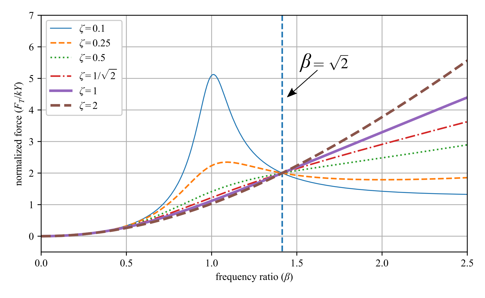

# Open Vibrations
An open-source textbook intended to cover the basics of mechanical vibrations. This text is intended to function as the only text required for a college (undergraduate) class on vibrations. 

A current PDF version of the text can be found in the releases tab of the GitHub page or by clicking <a href="https://github.com/ARTS-Laboratory/Open_Vibrations/releases">here</a>.

Shield: [![CC BY-SA 4.0][cc-by-sa-shield]][cc-by-sa]

This work is licensed under a
[Creative Commons Attribution-ShareAlike 4.0 International License][cc-by-sa].

[![CC BY-SA 4.0][cc-by-sa-image]][cc-by-sa]

[cc-by-sa]: http://creativecommons.org/licenses/by-sa/4.0/
[cc-by-sa-image]: https://licensebuttons.net/l/by-sa/4.0/88x31.png
[cc-by-sa-shield]: https://img.shields.io/badge/License-CC%20BY--SA%204.0-lightgrey.svg

Cite as  
@Misc{Downey2021OpenVibrations,  
  author = {Austin Downey and Laura Micheli},  
  month  = may,  
  title  = {Open Vibrations},  
  year   = {2021},  
  url    = {https://github.com/ARTS-Laboratory/Open_Vibrations},  
}  

